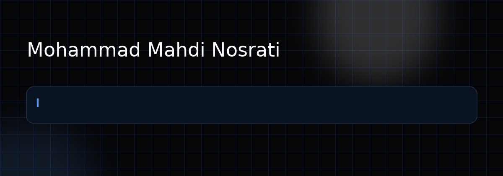

  

### AI Engineer · LLM Systems · RAG · AI Agents

**Software Engineering foundation · M.Sc. Artificial Intelligence**

 

  

**Engineering intelligence into real systems.**

 

## About

AI Engineer with a software-engineering foundation, focused on **LLM applications, retrieval systems, and AI agents**.

I care about **grounding, evaluation, and the engineering required to turn model capabilities into reliable products**.

 

<table>
<tr>
<td width="33%" valign="top">

### 01 / AI Systems

**LLM Applications**  
**RAG & Retrieval**  
**AI Agents**  
Context Engineering  
Multimodal AI

</td>

<td width="33%" valign="top">

### 02 / Engineering

**Backend Systems**  
REST / gRPC APIs  
Real-Time Applications  
Full-Stack Products  
Production Integration

</td>

<td width="33%" valign="top">

### 03 / Research

**LLM Evaluation**  
Retrieval Quality  
Grounded Generation  
Failure Analysis  
Reproducible Experiments

</td>
</tr>
</table>

 

## Tech Stack

### AI / Machine Learning

  

  

### Software Engineering

 

## Current Focus

<table>
<tr>
<td width="33%" valign="top">

### 01 / Adaptive RAG

Hybrid Retrieval  
Reranking  
Query Rewriting  
Evidence Evaluation

</td>

<td width="33%" valign="top">

### 02 / Agent Systems

Tool Use  
Stateful Workflows  
Structured Outputs  
Reliability

</td>

<td width="33%" valign="top">

### 03 / LLM Evaluation

Faithfulness  
Hallucination Analysis  
Failure Taxonomy  
Ablation Studies

</td>
</tr>
</table>

 

## GitHub Pulse

 

  

 

Contribution activity

  

<picture>
  <source media="(prefers-color-scheme: dark)" srcset="https://raw.githubusercontent.com/mmnsrti/mmnsrti/output/github-snake-dark.svg" />
  <source media="(prefers-color-scheme: light)" srcset="https://raw.githubusercontent.com/mmnsrti/mmnsrti/output/github-snake.svg" />
  
</picture>

  

### Engineering intelligence into real systems.

**AI × Software Engineering × Research**

 

